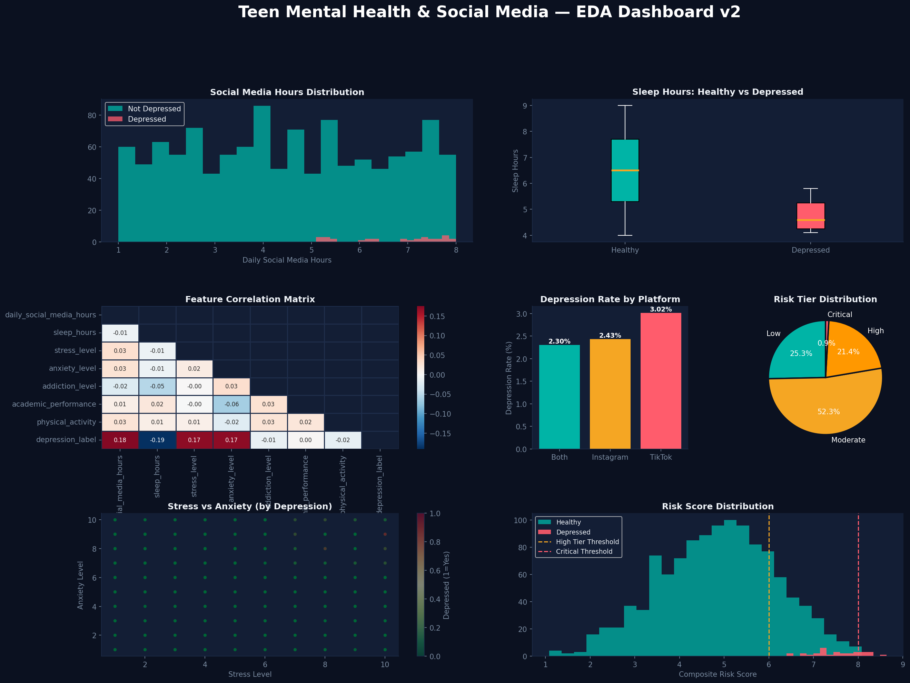

# 🧠 Teen Mental Health & Social Media Analytics

My first end-to-end data analytics project using Python, SQL, Power BI, and Machine Learning.

This project explores how social media habits, sleep patterns, stress, and anxiety levels may relate to depression risk among teenagers. I built this project to practice real-world data analysis and improve my skills in data visualization, dashboards, SQL, and machine learning.

---

# 📌 Why I Chose This Project

Mental health and social media are topics that affect many teenagers today. I wanted to work on a dataset that felt meaningful and also helped me understand how data can be used to discover patterns and generate insights.

Instead of only creating charts, I tried to approach this project like a beginner data analyst:
- clean the data
- analyze trends
- create dashboards
- identify important factors
- communicate insights clearly

---

# 🎯 Project Goals

- Practice data cleaning and preprocessing
- Perform Exploratory Data Analysis (EDA)
- Create visual dashboards and reports
- Understand relationships between behavior and mental health
- Build a beginner-level machine learning model
- Share insights in a simple and understandable way

---

# 📊 Dataset Overview

- Total Records: 1,200 teenagers
- Total Features: 13
- Missing Values: 0
- Target Column: `depression_label`

### Features Included
- Daily social media hours
- Sleep hours
- Stress level
- Anxiety level
- Addiction level
- Academic performance
- Physical activity
- Platform usage
- Social interaction level

---

# 🛠️ Tools & Technologies

| Tool | Usage |
|------|-------|
| Python | Data analysis |
| Pandas | Data cleaning |
| Matplotlib & Seaborn | Visualization |
| SQL | Querying and analysis |
| Power BI | Dashboard creation |
| Scikit-learn | Machine learning |
| GitHub | Project hosting |

---

# 📈 Key Insights From the Analysis

### 📱 Social Media Usage
Teens with depression tended to spend more time on social media compared to healthy teens.

### 😴 Sleep Patterns
Lower sleep hours appeared strongly connected with higher depression risk.

### 😰 Stress & Anxiety
Stress and anxiety levels were among the strongest indicators in the dataset.

### 📊 Platform Analysis
TikTok users showed slightly higher depression rates compared to Instagram users.

---

# 🤖 Machine Learning

I used a Random Forest Classifier to understand which features were most important in predicting depression risk.

### Most Important Features
1. sleep_hours
2. stress_level
3. daily_social_media_hours
4. anxiety_level

The main purpose of the model was learning feature importance and understanding predictive analysis basics.

---

# 📊 Dashboard Preview

## EDA Dashboard

---
